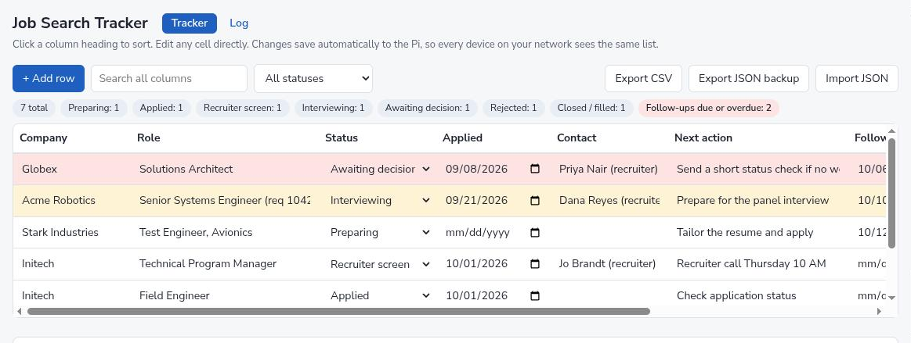
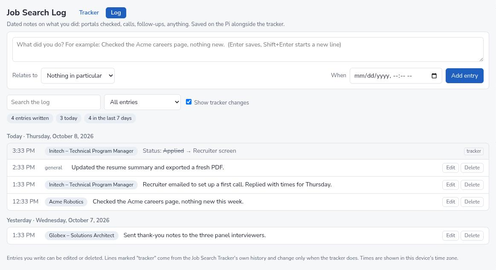

# Job Search Tracker

A small self-hosted web app for keeping a job search organised: one table of
applications and one dated activity log, served from a single Python file
with a SQLite database. No dependencies beyond Python 3, no build step, no
accounts.

It runs on a Raspberry Pi on a home network, so a laptop and a phone see the
same list.



## What it does

**Tracker**

- One row per application: company, role, status, date applied, contact,
  next action, follow-up date, notes.
- Edit any cell in place. Changes save as you type.
- Sort by any column, search across all of them, filter by status.
- Rows with a follow-up due within three days are shaded amber, overdue ones
  red. Ended applications are greyed out.
- Statuses separate "Rejected" from "Closed / filled", for a req that was
  cancelled or went to someone else without a rejection.
- Export to CSV or JSON, import from JSON.
- Every change is recorded, and deleted rows can be restored.

**Log**

- Dated free-text notes: a portal checked, a call made, a follow-up sent.
- Each note relates to nothing in particular, to a company, or to one
  specific application.
- The tracker's own events (status changes, rows added or removed) appear in
  the same timeline, so a day reads as one history.
- Search, filter by company, edit, delete, undo.



The screenshots use the fictional rows in `examples/seed.example.json`.

## Running it

```bash
git clone https://github.com/John-Schubert/job_search_tracker.git
cd job_search_tracker
PORT=8080 python3 server.py
```

Then open http://localhost:8080/. The database is created in `data/` on the
first start.

To begin with sample rows, copy the example file before the first start:

```bash
mkdir -p data && cp examples/seed.example.json data/seed.json
```

### As a service on port 80

`examples/job-tracker.service.example` is a systemd unit that runs the server
as an ordinary user on port 80, using `CAP_NET_BIND_SERVICE` instead of root,
with the filesystem read-only apart from `data/`. Replace `YOUR_USER`, then:

```bash
sudo install -m 644 examples/job-tracker.service.example /etc/systemd/system/job-tracker.service
sudo systemctl daemon-reload
sudo systemctl enable --now job-tracker.service
```

## Design notes

- **One file, standard library only.** `server.py` uses `http.server` and
  `sqlite3`. The two pages in `static/` are plain HTML and JavaScript.
- **No login, on purpose, so it must stay on a private network.** In place of
  a password the server refuses clients that are not on a private address,
  refuses requests whose `Host` header is not a private IP or a local name
  (which blocks DNS rebinding), and requires `Content-Type: application/json`
  on writes (which blocks cross-site form posts). Do not forward a public
  port to it.
- **Nothing is hard-deleted.** Rows and log entries are flagged as deleted
  and can be restored.
- **History without noise.** Edits to one field within five minutes are
  stored as a single change, and a change that is typed and then undone
  leaves no record.
- **Daily backups.** One copy of the database per day in `data/backups/`,
  thirty kept.

## API

| Method | Path | Purpose |
|---|---|---|
| GET | `/api/jobs` | All current rows |
| PUT | `/api/jobs/<id>` | Create or update a row |
| DELETE | `/api/jobs/<id>` | Remove a row (restorable) |
| POST | `/api/jobs/<id>/restore` | Restore a removed row |
| POST | `/api/import` | Replace the list with `{"rows": [...]}` |
| GET | `/api/history?limit=N` | Recent changes; `&major=1` for status changes, adds and removals only |
| GET | `/api/log` | All log entries |
| PUT | `/api/log/<id>` | Create or update a log entry |
| DELETE | `/api/log/<id>` | Remove a log entry (restorable) |
| POST | `/api/log/<id>/restore` | Restore a removed log entry |

## How it was built

The first version of the tracker page was a single HTML file that kept its
data in the browser. This project moved the data to a server so several
devices could share it, then added the change history, the log and the
network safeguards. It was built with Claude Code.

## Privacy

The repository contains code and fictional examples only. `data/` is ignored
by git, and a pre-commit hook in the working copy refuses to commit anything
from it.
